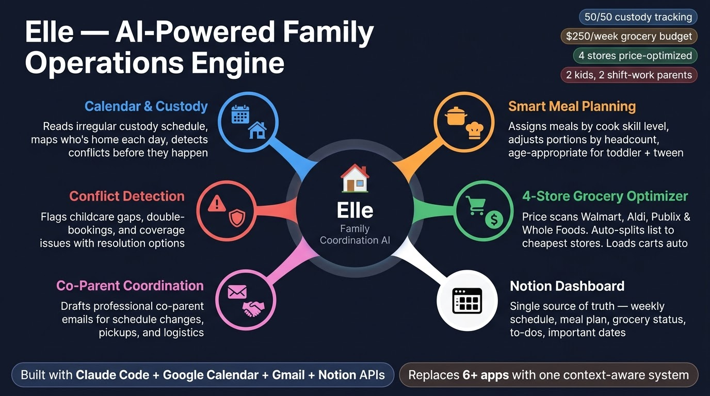

# Parent Helper

A [Claude Code](https://docs.anthropic.com/en/docs/claude-code) skill that turns Claude into your family's coordination engine — handling weekly schedules, meal planning, multi-store grocery optimization, custody tracking, and more.



## What It Does

Parent Helper is a single skill file that gives Claude deep context about your family so it can:

- **Weekly Briefing** — Generate a full week-ahead report every Sunday: who's home, who's working, what's for dinner, what needs attention
- **Meal Planning** — Plan meals matched to who's cooking, who's eating, dietary needs, and skill levels. Adjusts portions and recipes based on daily headcount
- **Multi-Store Grocery Bargain Hunter** — Price-compare across your local stores (Walmart, Aldi, Publix, Whole Foods, etc.), find the cheapest option per item, and auto-load carts via browser automation
- **Custody Schedule Awareness** — For blended families: reads irregular custody calendars, adjusts headcount, flags handoff logistics
- **Co-Parent Communication** — Draft professional, logistics-focused emails for co-parent coordination
- **Family Dashboard** — Maintain a Notion page as the family's single source of truth
- **Conflict Detection** — Catch double-bookings, childcare gaps, and schedule collisions before they happen

## How It Works

Parent Helper is a Claude Code **skill** — a markdown file that gives Claude specialized knowledge and capabilities for a specific domain. When you mention meals, schedules, groceries, or family logistics, Claude automatically activates the skill and operates with full context about your household.

It connects to your real services via MCP (Model Context Protocol) servers:

| Service | What It Does | Required? |
|---------|-------------|-----------|
| **Google Calendar** | Reads work shifts, custody days, school events, appointments | Yes |
| **Gmail** | Drafts co-parent emails, sends partner briefings | Optional |
| **Notion** | Family dashboard — single source of truth for the week | Optional |
| **Chrome** | Browser automation for grocery cart loading + price scanning | Optional |

## Quick Start

### 1. Get Claude Code

**Desktop app (recommended):** Download [Claude Code](https://claude.ai/download) for macOS or Windows — no terminal experience needed.

**Terminal CLI:** If you prefer the command line:
```bash
npm install -g @anthropic-ai/claude-code
```

Both work identically. The desktop app is the easiest way to get started.

### 2. Copy the Skill File

```bash
mkdir -p ~/.claude/skills/parent-helper
cp SKILL.md ~/.claude/skills/parent-helper/SKILL.md
```

### 3. Customize for Your Family

Open `~/.claude/skills/parent-helper/SKILL.md` and fill in the `{{PLACEHOLDER}}` fields:

- Family members (names, ages, roles)
- Work schedules and job types
- Dietary preferences and allergies
- Cooking skill levels for each parent
- Custody arrangements (if applicable)
- School schedules
- Local grocery stores and accounts
- Notion page/database IDs (if using Notion)

See [`setup/family-config-example.md`](setup/family-config-example.md) for a fully filled-in example.

### 4. Connect MCP Servers

At minimum, you need Google Calendar MCP. See [`setup/SETUP.md`](setup/SETUP.md) for step-by-step instructions on connecting each service.

### 5. Start Using It

```
> plan the week

> what's for dinner tonight?

> bargain hunt the grocery list

> load the carts

> email [co-parent] about the schedule change Friday
```

## Example Output

Here's what a Sunday night briefing looks like (from [`examples/sunday-briefing-example.md`](examples/sunday-briefing-example.md)):

```
## Family Week Ahead: March 15-21

### Who's Home
| Day       | Kids Home | Parent 1  | Parent 2  | Headcount | Cook     |
|-----------|-----------|-----------|-----------|-----------|----------|
| Mon 3/16  | Alex      | Working   | Off       | 3         | Parent 2 |
| Tue 3/17  | Alex, Sam | Off       | Working   | 4         | Parent 1 |
| Wed 3/18  | Sam       | Off       | Working   | 3         | Parent 1 |
| ...

### Watch Out
1. Tuesday: Both parents have overlapping shifts 7-9 AM — need babysitter coverage
2. Thursday: Alex has early dismissal (noon) — who's picking up?

### Meal Plan
Monday: Crockpot chicken tacos (Parent 2 — easy prep, 5 ingredients)
Tuesday: Sheet pan honey garlic salmon + roasted veggies (Parent 1 — full house night)
...

### Grocery List
Proteins: chicken thighs (2 lb), salmon fillets (4), ground beef (1 lb)
Produce: sweet potatoes (4), broccoli (2 heads), onions (3)...
```

## Multi-Store Grocery Savings

The bargain hunter scans your local stores and splits the list to minimize cost:

```
Best Split This Week: $152.30 (saved $63.85 vs all-Whole-Foods — 30% cheaper)

WALMART (Walmart+ delivery) — $48.20
   Whole milk (gal)      $2.92  (vs $7.99 WF)
   Eggs (dozen)          $1.67  (vs $4.39 WF)
   Frozen pancakes       $3.74  (vs $3.79 WF)

ALDI (Instacart pickup) — $31.50
   Strawberries (1lb)    $1.99  (vs $3.99 WF)
   Sparkling water 12pk  $4.85  (vs $5.99 WF)

PUBLIX (0.8 mi pickup) — $22.10
   Chicken thighs 2lb    $4.41  BOGO! (vs $8.99 WF)

WHOLE FOODS (Prime delivery) — $50.50
   Organic spinach       $3.49  (best price here)
   365 Pasta sauce       $2.99  (best price here)
```

## Project Structure

```
parent-helper/
  SKILL.md                           # The skill file — copy to ~/.claude/skills/parent-helper/
  README.md                          # You're reading it
  LICENSE                            # MIT
  setup/
    SETUP.md                         # Step-by-step MCP setup guide
    store-profiles.md                # Pre-built profiles for 15+ US grocery stores
    family-config-example.md         # Example of a fully configured family profile
  examples/
    sunday-briefing-example.md       # Example weekly briefing output
  assets/
    parent-helper-banner.jpg         # Banner image
```

## Customization Tips

- **Pick your stores.** Pre-built profiles for 15+ US grocery stores are in [`setup/store-profiles.md`](setup/store-profiles.md) — Walmart, Kroger, Publix, H-E-B, Aldi, Meijer, Whole Foods, Target, Safeway, Costco, and more. Copy the profiles for your local stores into the SKILL.md. If your store isn't listed, the "How to Add Any Store" guide walks you through building a profile in 5 minutes.
- **Start simple.** You don't need every integration on day one. Start with just Google Calendar and meal planning. Add Notion, Chrome automation, and grocery bargain hunting later.
- **Be specific in food profiles.** The more detail you give about each person's preferences and cooking abilities, the better the meal plans get. "Doesn't like vegetables" is okay. "Doesn't like vegetables but will eat carrots roasted with honey, and tolerates spinach hidden in smoothies" is much better.
- **Cooking assignment logic is the secret weapon.** Matching meal complexity to the cook available that night is what makes the plans actually work in real life. A crockpot meal assigned to the less experienced cook on a work night beats an ambitious recipe that never gets made.
- **The grocery budget keeps you honest.** Set a weekly target and the system will flag when you're trending over.
- **Custody awareness matters.** If you have a blended family, the headcount-adjusted meal planning alone is worth the setup time.

## Requirements

- [Claude Code](https://claude.ai/download) — desktop app or terminal CLI (both work)
- At least one MCP server connected (Google Calendar recommended as the foundation)
- A Google Calendar with your family's schedules populated

## Optional Integrations

- **Notion** — for the persistent family dashboard
- **Gmail** — for co-parent coordination and partner briefing emails
- **Chrome MCP** ([Claude in Chrome](https://chromewebstore.google.com/detail/claude-in-chrome/)) — for grocery cart automation and multi-store price scanning

## Contributing

Found a way to make Parent Helper better for your family? PRs welcome.

Ideas for contributions:
- **New store profiles** — add your local store to `setup/store-profiles.md` (search URL, store brand, DOM tips, cart button)
- Meal plan templates for common dietary patterns (vegetarian, keto, allergen-free)
- Integration guides for additional MCP servers
- Localization for non-US school systems and grocery chains
- Regional store coverage (international grocery chains)

## License

MIT — see [LICENSE](LICENSE).

---

Built with [Claude Code](https://docs.anthropic.com/en/docs/claude-code) and the [Model Context Protocol](https://modelcontextprotocol.io/).
